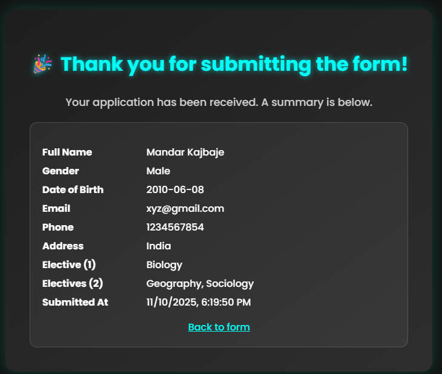

# Admission Form

A polished, static admission form for 11th-grade applications. It validates input, enforces subject selection rules, and shows a thank‑you page with a submission summary.

## Screenshots



## Features
- Client-side validation (required fields, 10-digit phone, DOB range)
- Exactly two selections enforced for Elective Group 2
- Accessible form structure (fieldsets, legends, focus-visible, aria-live)
- Reduced motion support
- LocalStorage-powered submission summary on thank-you page

## Quick Start
```powershell
# In project root
npx serve .
```
Open the served address in your browser, complete the form, and submit.

## Project Structure
```
index.html   # Main form
page2.html   # Thank-you + summary
style.css    # Styles with variables and animations
app.js       # Validation, redirect, summary
style.min.css# Minified CSS for production (optional)
```

## Validation Rules
- Phone: exactly 10 digits (0–9)
- DOB: valid date, at least 10 years before today (adjust per policy)
- Elective 1: select one option
- Elective 2: select exactly two checkboxes; UI prevents more than two

## Deployment: GitHub Pages
1. Push to `main` branch.
2. GitHub → Repository → Settings → Pages:
   - Source: `main` / root (`/`)
3. Wait for publish; open the Pages URL.

## Development Notes
- All inline scripts/styles have been moved to external files to enable CSP.
- Use the CSS variables in `style.css` to tweak theme and spacing.
- Summary data is removed from storage after rendering on `page2.html`.

### Production tips
- Swap `style.css` with `style.min.css` in your HTML for smaller payloads when deploying statically.
- Consider adding a Content Security Policy (CSP) once all inline code is removed. Example meta tag:
   ```html
   <meta http-equiv="Content-Security-Policy" content="default-src 'self'; style-src 'self' https://fonts.googleapis.com; font-src https://fonts.gstatic.com; script-src 'self';">
   ```

## Roadmap
- Stronger validation and error messaging
- Server-side API integration and persistence
- E2E tests with Playwright or Cypress
- Contrast and accessibility audits

## Author & License
- Author: Mandar Kajbaje (placeholder)
- License: MIT (recommended). Add a `LICENSE` file in the repo root.
